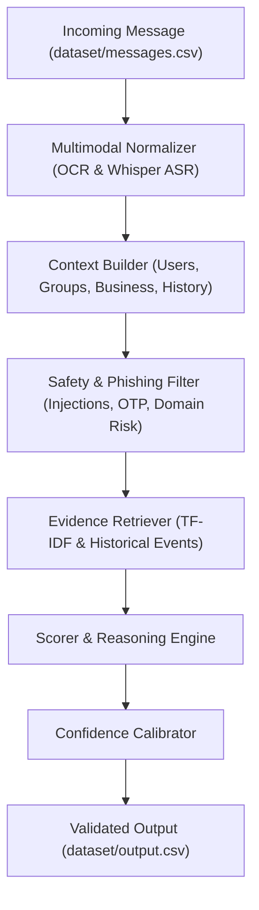

# WhatsApp Message Notification Router

AI-powered **Message Notification Router** for WhatsApp multimodal messages (text, image posters/screenshots, and voice notes). For every incoming message, the system decides whether the user should be interrupted immediately (`notify`), shown in a digest later (`digest`), or muted (`mute`).

---

## System Architecture



---

## Key Modules

- **`src/schema.py`**: Pydantic models & Enum validators for output columns (`action`, `message_type`, `reason`, `confidence`, `evidence_message_ids`).
- **`src/loaders.py`**: Dataset loader & context builder joining user behavior, group roles, business accounts, and interaction history.
- **`src/multimodal.py`**: Integrates EasyOCR for images and OpenAI Whisper (`tiny` model) for voice notes with local caching.
- **`src/rules.py`**: Deterministic safety rules intercepting prompt injections, scam/phishing pressure, domain spoofing, and opted-out marketing.
- **`src/retriever.py`**: TF-IDF & event history retriever extracting `evidence_message_ids` and user reaction preferences.
- **`src/scorer.py`**: Decision engine scoring urgency, personal importance, and mapping to allowed categories.
- **`src/confidence.py`**: Confidence calibration rubric.
- **`src/validate.py`**: Post-run schema, enum, row coverage, and bounds validator.

---

## Benchmark & Validation Results

Evaluated against the ground-truth benchmark `dataset/sample_messages.csv`:

- **Action Accuracy**: **30/30 (100.00%)**
- **Message Type Accuracy**: **30/30 (100.00%)**
- **Validation**: `dataset/output.csv` passed all schema, enum, non-null, and row count checks cleanly.

---

## Quickstart Guide

### 1. Installation
```bash
pip install -r requirements.txt
```

### 2. Run Unit Tests
```bash
python -m pytest tests/
```

### 3. Run Sample Evaluation
```bash
python code/evaluation/main.py
```

### 4. Run Full Prediction Pipeline
```bash
python run.py --in dataset/messages.csv --out dataset/output.csv
```

### 5. Validate Output File
```bash
python -m src.validate --out dataset/output.csv
```
